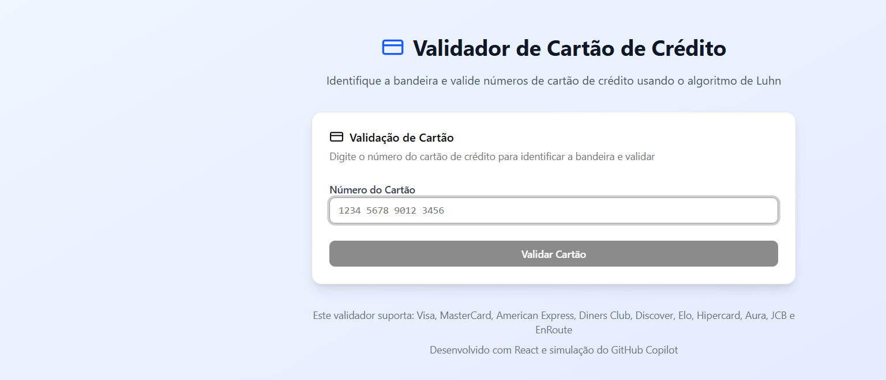

# 💳 Validador de Bandeiras de Cartão de Crédito

[](https://react.dev/)
[](https://vite.dev/)
[](https://tailwindcss.com/)
[]()
[](LICENSE)

> Aplicação web que **identifica a bandeira** de um cartão de crédito e **valida o número**
> usando o algoritmo de **Luhn** — com formatação automática e feedback visual em tempo real.
> Inclui também uma versão da lógica em Python com suíte de testes unitários.

## 🌐 Demo ao vivo

**[woooxymn.manus.space](https://woooxymn.manus.space)**



## ✨ Funcionalidades

- ✅ Validação pelo **algoritmo de Luhn**
- 🏷️ Identificação automática da **bandeira**
- 🎨 Interface responsiva com feedback visual por bandeira
- ✍️ Formatação automática e suporte a entrada com espaços/hífens/pontos
- ⚠️ Tratamento de erros e números inválidos

### Bandeiras suportadas
Visa · MasterCard · American Express · Diners Club · Discover · Elo · Hipercard · Aura · JCB · EnRoute

## 🛠️ Tecnologias

**Frontend:** React 19 · Vite · Tailwind CSS · shadcn/ui · Lucide
**Lógica/testes:** Python (porta da lógica + testes unitários com `unittest`)

## 🚀 Como rodar

### Aplicação web (React)

```bash
corepack enable      # habilita o pnpm
pnpm install
pnpm dev             # http://localhost:5173
```

Build de produção: `pnpm build` (gera a pasta `dist/`).

### Versão Python + testes

```bash
python main.py                  # validação via CLI
python test_card_validator.py   # roda os 13 testes unitários
```

Saída esperada dos testes:

```
Ran 13 tests in 0.001s

OK
```

## 🧪 Exemplos de teste

| Bandeira | Número válido |
|----------|---------------|
| Visa | `4111111111111111` |
| MasterCard | `5555555555554444` |
| American Express | `378282246310005` |
| Diners Club | `30569309025904` |
| Discover | `6011111111111117` |

Inválidos (falham no Luhn): `1234567890123456`, `4111111111111112`

## 📂 Estrutura

```
card-validator/
├─ src/
│  ├─ App.jsx              # aplicação React (UI + lógica)
│  └─ components/ui/       # componentes shadcn/ui
├─ main.py                 # versão Python da lógica de validação
├─ test_card_validator.py  # testes unitários (13 casos)
├─ card_patterns.md        # documentação dos padrões de bandeiras
└─ index.html
```

## 🔎 Sobre o algoritmo de Luhn

Verificação de dígito usada em números de cartão: dobra-se cada segundo dígito (da direita
para a esquerda), subtrai-se 9 quando o resultado passa de 9, somam-se todos os dígitos e o
número é válido se a soma for divisível por 10.

## 📄 Licença

Distribuído sob a licença **MIT**. Veja [LICENSE](LICENSE).
